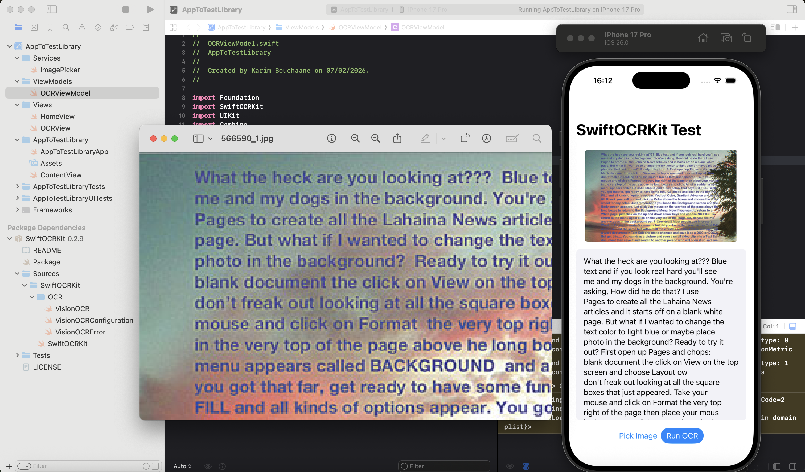

# SwiftOCRKit

SwiftOCRKit is a lightweight, Apple-native Swift package that provides clean, async/await wrappers around Apple Vision for on-device OCR (Optical Character Recognition) on iOS and macOS.

The goal of the library is to simplify Vision's text recognition APIs while keeping everything:

- **Apple-native** - Built on Apple Vision framework
- **Privacy-friendly** - 100% on-device processing, no network calls
- **Easy to integrate** - Simple async/await API
- **Production-ready** - Proper error handling and configuration options



## Features

 **Optical Character Recognition (OCR)**
- Extract text from UIImage, NSImage, or CGImage
- Async/await API
- Configurable recognition levels (.accurate or .fast)
- Language correction support
- Custom language selection
- Minimum text height filtering
- Comprehensive error handling

## Requirements

- iOS 15.0+
- macOS 12.0+
- Swift 5.7+
- Xcode 14.0+

## Installation

### Swift Package Manager

Add SwiftOCRKit using Xcode:

1. **File → Add Packages**
2. Enter the repository URL:
   ```
   https://github.com/DrcKarim/SwiftOCRKit
   ```
3. Add the package to your target

Or add it to your `Package.swift`:

```swift
dependencies: [
    .package(url: "https://github.com/DrcKarim/SwiftOCRKit", from: "1.0.0")
]
```

## Usage

Import the library:

```swift
import SwiftOCRKit
```

### Basic OCR Example

```swift
// iOS
let image = UIImage(named: "document")!
let text = try await VisionOCR.recognizeText(from: image)
print(text)

// macOS
let image = NSImage(named: "document")!
let text = try await VisionOCR.recognizeText(from: image)
print(text)
```

### Advanced OCR with Configuration

```swift
let config = VisionOCRConfiguration(
    recognitionLevel: .accurate,        // or .fast for speed
    usesLanguageCorrection: true,       // improves accuracy
    minimumTextHeight: 0.02,            // filter small text
    recognitionLanguages: ["en-US"]     // specify languages
)

let text = try await VisionOCR.recognizeText(from: image, configuration: config)
print(text)
```

### Error Handling

```swift
do {
    let text = try await VisionOCR.recognizeText(from: image)
    print("Recognized text:", text)
} catch VisionOCRError.invalidImage {
    print("The provided image is invalid")
} catch VisionOCRError.noTextFound {
    print("No text was detected")
} catch VisionOCRError.visionError(let error) {
    print("Vision error:", error.localizedDescription)
} catch {
    print("Unexpected error:", error)
}
```

## Supported Platforms

| Platform | Supported |
|----------|-----------|
| iOS      | Yes       |
| macOS    | Yes       |
| watchOS  | No        |
| tvOS     | No        |

## Configuration Options

| Option | Type | Default | Description |
|--------|------|---------|-------------|
| `recognitionLevel` | `.accurate` or `.fast` | `.accurate` | Balance between speed and accuracy |
| `usesLanguageCorrection` | `Bool` | `true` | Apply language correction for better accuracy |
| `minimumTextHeight` | `Float` | `0.0` | Minimum text height (0.0 to 1.0). Filters out small text |
| `recognitionLanguages` | `[String]` | `[]` | Specific languages to recognize (e.g., `["en-US", "fr-FR"]`) |

## API Reference

### VisionOCR

```swift
// Basic API (uses default configuration)
static func recognizeText(from image: UIImage) async throws -> String
static func recognizeText(from image: NSImage) async throws -> String
static func recognizeText(from cgImage: CGImage) async throws -> String

// Advanced API (custom configuration)
static func recognizeText(from image: UIImage, configuration: VisionOCRConfiguration) async throws -> String
static func recognizeText(from image: NSImage, configuration: VisionOCRConfiguration) async throws -> String
static func recognizeText(from cgImage: CGImage, configuration: VisionOCRConfiguration) async throws -> String
```

### VisionOCRError

```swift
enum VisionOCRError: Error {
    case invalidImage           // Image could not be processed
    case noTextFound           // No text detected in image
    case visionError(Error)    // Underlying Vision framework error
}
```

## Architecture

SwiftOCRKit follows a clean, modular structure:

```
SwiftOCRKit/
└── OCR/
    ├── VisionOCR.swift               // Main OCR implementation
    ├── VisionOCRConfiguration.swift  // Configuration options
    └── VisionOCRError.swift          // Error types
```

## Why SwiftOCRKit?

Apple Vision is powerful but verbose. SwiftOCRKit simplifies it into a clean, modern API.

**Before (vanilla Vision):**
```swift
let request = VNRecognizeTextRequest { request, error in
    guard error == nil else { return }
    let observations = request.results as? [VNRecognizedTextObservation] ?? []
    let text = observations.compactMap { $0.topCandidates(1).first?.string }.joined(separator: "\n")
    // handle callback-based result...
}
request.recognitionLevel = .accurate
request.usesLanguageCorrection = true
let handler = VNImageRequestHandler(cgImage: cgImage)
try handler.perform([request])
```

**After (SwiftOCRKit):**
```swift
let text = try await VisionOCR.recognizeText(from: image)
```

## Roadmap

- [ ] Batch image processing
- [ ] PDF text extraction
- [ ] Confidence scores per text block
- [ ] Text region detection (bounding boxes)
- [ ] Barcode and QR code scanning
- [ ] Document detection and perspective correction

## Performance Tips

1. Use `.fast` recognition level for real-time or video processing
2. Use `.accurate` for document scanning and high-quality text
3. Set `minimumTextHeight` to filter out noise and small artifacts
4. Specify `recognitionLanguages` when you know the language for better accuracy

## Contributing

Contributions are welcome!

You can:
- Open issues for bugs or feature requests
- Submit pull requests with improvements
- Suggest new Vision-based features

Please keep changes focused and consistent with the existing API style.

## License

MIT License  
Copyright (c) 2026
**Made with ❤️ by [Karim Bouchaane](https://github.com/DrcKarim)**
